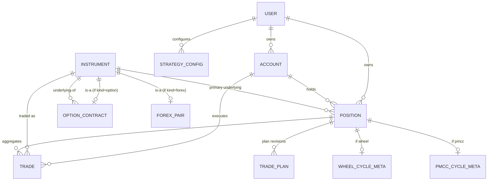

# Data Model — v0 Draft

**Language:** English | [中文](./data-model.zh.md)

> Status: **DRAFT v0.2** (2026-05-18). Initial design for the rebuild on `refactoring/rebuild`. This document is the source of truth for schema discussion; iterate here before writing migrations. Changelog at the bottom.

## 1. Purpose and design principles

The previous version of this trading journal stalled because the data model **lost expandability** — adding a new strategy or instrument type forced changes across many tables and code paths. This redesign starts from three principles:

1. **Atomic trades, generic aggregates.** A `Trade` is a single broker-level fill. A `Position` is the strategy-instance aggregate (what the user currently calls "cycle" or "position" in Notion, depending on strategy). Strategies do not own the trades table; they tag positions and (optionally) attach extension metadata.
2. **Polymorphic instruments via class-table extensions.** Stocks, options, and forex pairs share a generic `Instrument` base but extend it with type-specific tables. New instrument categories (futures, crypto) plug in the same way.
3. **Derived where possible, snapshot only where necessary.** PnL, days-open, ROI, and similar values are computed from trades on read. The only "snapshot" fields are those that genuinely lose meaning if recomputed (e.g., `max_risk_at_open` for a defined-risk multi-leg option position; `pnl_realized` frozen at close-time so historical results don't drift).

These three together make the schema additive: adding wheel, iron condor, PMCC, butterfly, calendar, forex CFD, or crypto becomes "add a strategy_type enum value, optionally add an extension table" — not a schema-wide refactor.

## 2. Entity overview

| Entity | Role |
|---|---|
| `User` | App user. MVP uses FastAPI Users for password + cookie auth; OAuth/MFA/Audit/BrokerCredential reserved as future tables (see §7). |
| `Account` | A broker trading account (Fidelity, IBKR, Saxo, etc.). |
| `Instrument` | A tradable asset, polymorphic by `kind`. |
| `OptionContract` | Extension of Instrument for options (strike, expiry, opt_type, multiplier). |
| `ForexPair` | Extension of Instrument for forex (base/quote currency, pip size). |
| `Position` | A strategy-instance aggregate. Universal across strategies. |
| `Trade` | An atomic broker-level fill. Belongs to a Position. |
| `TradePlan` | Pre-trade plan and its revisions. **Event stream** attached to a Position. |
| `StrategyConfig` | Strategy-level configuration (e.g., IC max exposure cap). |
| `WheelCycleMeta` | Strategy-specific extension for wheel positions. |
| `PmccCycleMeta` | Strategy-specific extension for LEAP+PMCC positions. |

**Removed since v0.1**: `IcPositionMeta` (its only field `max_risk_at_open` is now generic on `Position`, applicable to any defined-risk multi-leg strategy).

## 3. ER diagram

## 4. Entities

> **Type conventions used below.** `numeric(p, s)` is *exact-decimal* fixed-point storage: `p` is the **total** significant digits, `s` is the digits **after the decimal point**. SQLAlchemy maps it to Python `Decimal`, so there is **no floating-point error**. Both Postgres `NUMERIC` and SQLite `NUMERIC` support this.
>
> Defaults we use throughout:
> - **Prices** — `numeric(18, 6)` (covers stocks/options/forex with comfortable headroom)
> - **Quantities** — `numeric(18, 8)` (supports fractional shares and forex micro-lots)
> - **Money / PnL / cash flow** — `numeric(18, 4)`
> - **Rates / percentages** — `numeric(8, 6)` (e.g., `0.045500` = 4.55% APR)
>
> All primary keys are `uuid`. All timestamps are `timestamptz` (app enforces UTC).

### 4.1 User

Matches FastAPI Users default schema so the library handles password hashing (bcrypt), cookie/JWT session strategy, and the official OAuth extension out of the box.

| Field | Type | Notes |
|---|---|---|
| id | uuid PK | |
| email | text unique | |
| hashed_password | text | bcrypt by default; argon2 swappable. |
| is_active | bool | Default `true`. Soft-suspend by setting false. |
| is_verified | bool | Email verification flag. |
| is_superuser | bool | App-level admin. |
| last_login_at | timestamptz nullable | Set on successful login. Personal-grade anomaly cue. |
| created_at | timestamptz | |

**Future auth surface** (NOT in MVP, deferred to a separate `docs/design/auth-and-security.md` when needed — see §7): OAuthAccount, MfaCredential, MfaBackupCode, AuditLog, BrokerCredential. Each is a **new table with `user_id` FK to User**, so adding them never modifies the User schema.

### 4.2 Account

A broker trading account. Distinct from the journal's app-level User.

| Field | Type | Notes |
|---|---|---|
| id | uuid PK | |
| user_id | uuid FK → User | |
| name | text | "Fidelity Roth", "IBKR Margin", etc. |
| broker | text | "Fidelity" / "IBKR" / "Saxo" / ... |
| account_type | enum | `cash`, `margin`, `paper`. |
| base_currency | text | ISO 4217: `USD`, `EUR`, ... |
| notes | text nullable | |
| created_at | timestamptz | |
| archived_at | timestamptz nullable | Soft delete; preserves history. |

**Note**: `account_type` is the broker's own classification (cash vs margin vs paper-trading). The Wheel concept of "mixed funding" lives on `WheelCycleMeta.funding_source` (§4.8), not here — a margin account can hold an entirely cash-funded position.

### 4.3 Instrument (base) + extensions

#### Instrument

| Field | Type | Notes |
|---|---|---|
| id | uuid PK | |
| kind | enum | `stock`, `option`, `forex` (future: `future`, `crypto`). |
| symbol | text | "NVDA", "EURUSD". For options this is the underlying symbol. |
| exchange | text nullable | "NASDAQ", "EURONEXT". Separated per user's note: future support for cross-exchange listings. |
| currency | text | Trading currency of the instrument, ISO 4217. |
| created_at | timestamptz | |

#### OptionContract (extends Instrument when kind=option)

| Field | Type | Notes |
|---|---|---|
| instrument_id | uuid PK, FK → Instrument | 1:1 with Instrument. |
| underlying_id | uuid FK → Instrument | Points to the stock/index Instrument. |
| opt_type | enum | `call`, `put`. |
| strike | numeric(18, 6) | |
| expiry | date | |
| multiplier | int | Default 100 (US equity options). Field so future variants are supported. |
| style | enum | `american`, `european`. Default `american`. |

#### ForexPair (extends Instrument when kind=forex)

| Field | Type | Notes |
|---|---|---|
| instrument_id | uuid PK, FK → Instrument | |
| base_currency | text | "EUR" |
| quote_currency | text | "USD" |
| pip_size | numeric(10, 8) | e.g., 0.0001 for most majors. |
| contract_size | numeric(18, 4) nullable | Lot size; defer for MVP if unsure. |

**Stocks** need no extension table — Instrument fields cover everything for MVP.

### 4.4 Position (universal strategy instance)

The single most important entity. Every active strategy instance — wheel cycle, IC position, PMCC cycle, forex trade, stock holding — is a Position.

| Field | Type | Notes |
|---|---|---|
| id | uuid PK | |
| user_id | uuid FK → User | |
| account_id | uuid FK → Account | |
| primary_instrument_id | uuid FK → Instrument | Underlying for option strategies; the stock/forex itself for spot. Used for grouping/queries. |
| strategy_type | enum | `wheel`, `iron_condor`, `pmcc`, `spot_stock`, `spot_forex` (extensible). |
| status | enum | `open`, `closed`. |
| opened_at | timestamptz | First trade's executed_at. |
| closed_at | timestamptz nullable | Last trade's executed_at when status flips to closed. |
| capital_used | numeric(18, 4) nullable | Strategy-defined "money at risk" (see notes below). Manual in MVP; future: computed. |
| max_risk_at_open | numeric(18, 4) nullable | Snapshot of max loss at open. Applies to any defined-risk position (IC, vertical, butterfly, etc.). Stays null for undefined-risk positions (PMCC, spot). |
| max_reward_at_open | numeric(18, 4) nullable | Snapshot of max profit at open. Same applicability as `max_risk_at_open`. |
| pnl_realized | numeric(18, 4) nullable | **Frozen on close**: when status transitions to `closed`, computed from trade cash flows and stored. Stays null while open. |
| currency | text | Reporting currency for this position (usually matches account). |
| notes | text nullable | Free-text rationale. |
| created_at | timestamptz | |
| updated_at | timestamptz | |

**Derived (NOT stored)**: `days_open`, `pnl_unrealized`, `pnl_total`, `roi_on_capital`, `annualized_return`, `result` (win/loss). Computed at read time from `Trade` rows (and market quotes for unrealized when status=open).

**`capital_used` semantics per strategy**:
- Wheel: `strike × 100 − premium` (currently manual; trivially computable from the first sell-put trade).
- Iron condor / vertical spread / butterfly: equal to `max_risk_at_open`.
- PMCC: LEAP buy cost.
- Spot stock: total buy cost.
- Spot forex: position margin × leverage (TBD).

### 4.5 Trade (atomic event)

A single broker fill. The future broker-API integration will populate this table directly; for MVP the user enters trades manually.

| Field | Type | Notes |
|---|---|---|
| id | uuid PK | |
| position_id | uuid FK → Position | Every trade belongs to a position. |
| account_id | uuid FK → Account | Denormalized; matches position.account_id. |
| instrument_id | uuid FK → Instrument | The exact instrument traded (specific OptionContract for option trades). |
| action | enum | See `TradeAction` below. |
| quantity | numeric(18, 8) | Stocks: shares (fractional supported). Options: contracts (always integer; enforced at app layer). Forex: lots/units (micro-lots supported). |
| price | numeric(18, 6) | Per-share / per-contract / per-unit. For options, **per single contract** (not total), matching user's Notion convention. |
| commission | numeric(18, 4) | |
| fees | numeric(18, 4) | Other regulatory/exchange fees, separated from commission for tax breakouts. |
| cash_flow | numeric(18, 4) | Signed net cash impact. Negative = cash out (buys). Positive = cash in (sells, opening short options). Stored both because broker-API reports it directly and to avoid recomputation on every read. |
| executed_at | timestamptz | |
| order_group_id | uuid nullable | Trades that came from the same user action / broker order share this ID. See §4.5.2 below. |
| broker_trade_id | text nullable | Set when imported from broker API; null for manual entries. |
| notes | text nullable | |

#### 4.5.1 TradeAction enum

Universal across instrument types. Six values, deliberately strategy-agnostic — the previous Notion `type` field conflated open/close semantics with strategy names; this design separates them cleanly.

| Action | Applies to | Meaning |
|---|---|---|
| `buy` | stock, forex | Open or add to long position. |
| `sell` | stock, forex | Close or reduce long position. |
| `bto` | option | Buy to open (long option). |
| `sto` | option | Sell to open (short option). |
| `btc` | option | Buy to close. |
| `stc` | option | Sell to close. |

**No `assign` / `exercise` / `expire` action.** These events are modeled as their constituent atomic trades — exactly what the broker reports. See the mapping table next. The frontend detects patterns (paired option-close + stock fill on same `order_group_id`) and displays them as "Assignment" / "Exercise" / "Expiration" labels.

#### 4.5.2 Notion event → atomic trade mapping

This is how each event the user records in Notion today decomposes into rows in the new `Trade` table.

| Notion event | Atomic Trade rows |
|---|---|
| sell put | 1 row: `sto` on the put OptionContract |
| close sell put | 1 row: `btc` on the put OptionContract |
| sell call | 1 row: `sto` on the call OptionContract |
| close sell call | 1 row: `btc` on the call OptionContract |
| buy LEAP | 1 row: `bto` on the LEAP OptionContract |
| close LEAP | 1 row: `stc` on the LEAP OptionContract |
| **assignment** (short put) | 2 rows, same `order_group_id`: `btc` put @ 0.00 + `buy` 100 shares @ strike |
| **assignment** (short call) | 2 rows, same `order_group_id`: `btc` call @ 0.00 + `sell` 100 shares @ strike |
| **exercise** (long call) | 2 rows, same `order_group_id`: `stc` call @ 0.00 + `buy` 100 shares @ strike |
| **exercise** (long put) | 2 rows, same `order_group_id`: `stc` put @ 0.00 + `sell` 100 shares @ strike |
| **expire** (short option, worthless) | 1 row: `btc` @ 0.00, commission 0, fees 0 |
| **expire** (long option, worthless) | 1 row: `stc` @ 0.00, commission 0, fees 0 |
| open iron condor | 4 rows, same `order_group_id`: `bto` long put + `sto` short put + `sto` short call + `bto` long call |
| close iron condor, full | 4 rows, same `order_group_id`: `btc`/`stc` for each leg |
| close iron condor put side | 2 rows, same `order_group_id`: `btc` short put + `stc` long put |

**Why this is better than a special `assign` enum value:** the source of truth becomes "what the broker actually filled." Same broker fills, same Trade rows — no parallel representation. UI labels become a pure display layer that detects patterns by `order_group_id` + timing + magnitude.

### 4.6 TradePlan (event stream)

Forex CFD entries in the user's Excel include pre-trade levels. In real trading, those levels evolve — the trader moves stop-loss as price moves, takes off partial profit, etc. So TradePlan is modeled as an **event stream**: each row is a plan *revision*, and the most recent revision is the current plan. Old rows are preserved as history.

| Field | Type | Notes |
|---|---|---|
| id | uuid PK | |
| position_id | uuid FK → Position | Many revisions per position. |
| revision_no | int | Monotonically increasing within a position. First revision = 1. |
| effective_at | timestamptz | When this revision became the active plan. |
| planned_entry | numeric(18, 6) nullable | |
| planned_stop_loss | numeric(18, 6) nullable | |
| planned_take_profit | numeric(18, 6) nullable | |
| target_rr | numeric(8, 4) nullable | Risk-to-reward ratio. |
| thesis | text nullable | Trade idea / setup (usually only on revision 1). |
| reason | text nullable | Why this revision (e.g., "moved SL to BE after +1R"). |
| created_at | timestamptz | When the revision was recorded. |

Unique on `(position_id, revision_no)`. Application queries "current plan" via `MAX(revision_no) per position_id`, or equivalently the row with the latest `effective_at`.

Partial closes and resizes are recorded in `Trade` (a `sell` row with reduced quantity), not in TradePlan. TradePlan only captures intent.

### 4.7 StrategyConfig (strategy-level configuration)

| Field | Type | Notes |
|---|---|---|
| id | uuid PK | |
| user_id | uuid FK → User | |
| strategy_type | enum | Matches `Position.strategy_type`. |
| max_exposure | numeric(18, 4) nullable | E.g., the user's $3000 cap on aggregate iron-condor `max_risk_at_open`. |
| exposure_currency | text | Currency of the cap. |
| notes | text nullable | |
| updated_at | timestamptz | |

Unique on `(user_id, strategy_type)`.

**Future use:** when a broker-API order is being placed, the journal checks `sum(open_positions.max_risk_at_open where strategy=X) + new_order_max_risk ≤ max_exposure` and refuses to open if exceeded.

### 4.8 Strategy-specific extensions

Extension tables are 1:1 with Position (matched by `position_id`). They hold *snapshot* and *configuration* data that only makes sense for one strategy. Derived/computed values stay off these tables. Strategies whose snapshots are generic (like `max_risk_at_open`) use the field on `Position` directly and need no extension table.

#### WheelCycleMeta

| Field | Type | Notes |
|---|---|---|
| position_id | uuid PK, FK → Position | |
| funding_source | enum | `cash`, `mixed`, `margin`. Independent of `Account.account_type` — a margin account can run a cash-only cycle. |
| loan_amount | numeric(18, 4) nullable | Margin borrowed if applicable. |
| interest_rate_apr | numeric(8, 6) nullable | Currently user-entered; future: pulled per-day from broker API. |
| interest_accrued | numeric(18, 4) nullable | Sum of daily interest. Manually entered total for MVP; future modeling discussed in §7. |

#### PmccCycleMeta

| Field | Type | Notes |
|---|---|---|
| position_id | uuid PK, FK → Position | |
| leap_instrument_id | uuid FK → Instrument | The specific LEAP OptionContract. Convenience pointer; also derivable from the first trade. |

**Why no `IcPositionMeta`:** the only IC-specific snapshot is `max_risk_at_open`, which generalizes to any defined-risk multi-leg structure (vertical, butterfly, condor variants). It now lives on `Position` directly. If iron-condor-specific fields appear later, the extension table can be added without disturbing existing data.

## 5. How each strategy maps to the model

### 5.1 Wheel
- One Position with `strategy_type = wheel`, `primary_instrument_id` = the underlying stock.
- Trades: `sto`(put), optionally `btc`(put), the assignment pair (`btc` put @ 0 + `buy` 100 shares), `sto`(call) × N interleaved with `btc`(call) or expirations, eventually either the exercise pair (`btc` call @ 0 + `sell` 100 shares) or a discretionary `sell` of the stock.
- WheelCycleMeta carries funding info.
- Status flips to `closed` when there are no open option legs and net stock position is 0.

### 5.2 Iron condor
- One Position with `strategy_type = iron_condor`, `primary_instrument_id` = the underlying stock.
- Opening event = 4 Trade rows (one per leg: long put, short put, short call, long call), sharing one `order_group_id`. This matches the broker's actual fills.
- `Position.max_risk_at_open` is computed at open and stored: `(wing width × multiplier × qty) − net credit`.
- Subsequent: `btc`/`stc` rows for partial or full close, or zero-priced rows for legs that expire worthless.
- Status flips to `closed` when all 4 legs are closed/expired.

### 5.3 LEAP + PMCC
- One Position with `strategy_type = pmcc`, `primary_instrument_id` = the underlying stock.
- First trade: `bto`(LEAP). PmccCycleMeta.leap_instrument_id set.
- Repeated short-call cycle: `sto`(short call) → either `btc`(roll/close), expiration row, or an assignment pair (rare; if it happens, becomes a complex situation — see §7).
- Roll of short call = `btc` (close current) + `sto` (open new), both rows in same Position; commonly sharing one `order_group_id` if the broker fills them together.
- Cycle ends with `stc`(LEAP) or LEAP expiration row.

### 5.4 Spot stock (long-only for MVP)
- One Position with `strategy_type = spot_stock`, `primary_instrument_id` = the stock.
- Trades: `buy` × N (DCA allowed), eventually `sell` × M.
- Status closes when net shares = 0.

### 5.5 Spot forex CFD
- One Position with `strategy_type = spot_forex`, `primary_instrument_id` = the ForexPair.
- Trades: `buy` (or `sell` for shorts) at entry, `sell` (or `buy`) at exit; partial closes are additional Trade rows with reduced quantity.
- TradePlan attached as event stream: revision 1 captures the initial plan; subsequent revisions record SL/TP moves.

## 6. Key design decisions and trade-offs

### Generic `Position` over per-strategy tables
**Decision:** One `Position` table for all strategies. **Why:** every strategy answers the same questions (when did it open, what's the PnL, what instrument, what account). Per-strategy tables would force union queries for portfolio views and duplicate every derived calculation. Adding a new strategy under the generic model is a 1-line enum addition + (maybe) an extension table.

### Class-table inheritance for instruments
**Decision:** `Instrument` base + `OptionContract`/`ForexPair` extensions. **Why:** option-specific FKs (`OptionContract.underlying_id`) cannot be expressed cleanly on a wide table. CTI keeps queries against options strongly typed. The "wide table" approach is exactly what bit the previous version's expandability — adding crypto would add more nullable columns to a table already messy with option fields.

### `max_risk_at_open` on `Position`, not on a strategy extension
**Decision:** Generic field on Position. **Why:** the concept generalizes to any defined-risk strategy. Putting it on Position lets us add vertical spreads / butterflies / iron flies later without touching the schema, and avoids a tiny extension table that holds a single field.

### Why some snapshots are stored
- **`max_risk_at_open`**: recomputing it would change ROI denominators as positions evolve. User explicitly wants the open-time value preserved.
- **`pnl_realized` after close**: freezes historical results so they don't drift if trades are ever back-edited or if computation logic changes; also avoids recomputing across many closed positions for portfolio-level reports.

### Roll = two adjacent Trade rows
**Decision:** Rolls are just two adjacent Trade rows (close + open) on the same Position, optionally with shared `order_group_id`. **Why:** the user's spec is "roll = close + open under same cycle". A separate Roll table would be bookkeeping with no behavioral consequence.

### `assign` / `exercise` / `expire` as atomic trades, not enum values
**Decision:** Drop these from TradeAction; record them as their actual broker fills. **Why:** the broker reports atomic trades (option close at 0, stock fill at strike). Matching that representation eliminates a divergence between the journal's data and what the broker actually did. UI labels are a pure rendering concern, detected via `order_group_id` + zero-price patterns.

### PnL: stored only after close
- While open: computed from realized trade cash flows + mark-to-market on remaining legs.
- After close: snapshot in `pnl_realized` so historical results are stable.
- Tradeoff vs. always-derive: small storage cost; substantial query and stability benefit.

### Currency placement
- `Instrument.currency` is the quote currency of the instrument.
- `Account.base_currency` is what the broker books the account in.
- `Position.currency` is the reporting currency (usually account base).
- Cross-currency PnL conversion is deferred. MVP assumes position currency = instrument currency = account currency.

### SQLite → Postgres portability
- All numeric columns use `numeric(p, s)`, exact-decimal in both engines.
- UUIDs: SQLite stores as TEXT; Postgres uses native uuid. SQLAlchemy `Uuid` type handles both.
- `timestamptz` on Postgres becomes naive `timestamp` on SQLite; app-level UTC discipline required either way.
- No JSON-heavy columns in this draft; if added later, both engines have JSON support but with different semantics — would prefer to avoid.

## 7. Open questions and future extensions

### Open design questions (still need a decision before implementation)

1. **`delta_at_open` (and other option-specific snapshots) on Trade.** User's Notion records delta at the time an option is opened. Add directly to `Trade` as nullable, or create a `TradeOptionMeta` extension table to hold delta/IV/theta/vega snapshots? **Lean: extension table**, to keep `Trade` clean and allow more option-snapshot fields later.
2. **Strategy-level exposure computation perf.** §4.7 mentions enforcement at order-placement time. Schema-wise this is just a query; if it grows expensive we may want a materialized view or summary table. Defer.
3. **Interest accrual for Wheel margin.** Currently a single `interest_accrued` field. Future may want per-day rows so daily APR changes are honored. Defer until broker API integration.
4. **Tags / labels on Position.** Not yet modeled. Easy to add later as `tag` + `position_tag` link table.
5. **Soft delete for Position and Trade.** `Account` has `archived_at`; should `Position` and `Trade` get the same? Recommend yes for audit, but confirm before adding.
6. **`primary_instrument_id` redundancy.** Convenient pointer; technically derivable from trades. Keep stored for query performance; enforce on insert.

### Future extensions (deferred, schema not committed yet)

Each item below will get a dedicated design pass in `docs/design/auth-and-security.md` (to be written when this work begins). The current `User` schema is intentionally minimal so each extension adds **new tables with `user_id` FK** rather than modifying existing tables.

| Extension | Trigger to implement | Sketch of schema shape |
|---|---|---|
| `OAuthAccount` | Adding Google/GitHub/etc. social login | `user_id FK, oauth_name, account_id, account_email, access_token, refresh_token, expires_at` (FastAPI Users official shape). |
| `MfaCredential` + `MfaBackupCode` | Before any sensitive action support beyond password (definitely before broker API) | `MfaCredential(user_id FK, method=totp/webauthn, secret_encrypted, device_name, created_at, last_used_at)`; `MfaBackupCode(user_id FK, code_hash, used_at)`. |
| `AuditLog` | Before broker API integration; ideally earlier | `id, user_id FK, event_type enum, ip, user_agent, metadata jsonb, occurred_at`. Append-only. |
| `BrokerCredential` | When broker API integration begins | `id, user_id FK, account_id FK, broker_name, credential_encrypted, kek_id, scope, created_at, last_used_at`. Envelope-encrypted; main KEK in env / secrets manager. |

All four are **purely additive** — adding any of them does not modify `User`, `Account`, `Position`, or `Trade`.

### Resolved items (closed since v0.1)

- ~~`assign` / `exercise` decompose timing~~ — resolved: drop the synthetic actions entirely, model as atomic broker trades from the start (§4.5.2).
- ~~Multi-leg open as one user action~~ — resolved: `Trade.order_group_id` groups all trades from one user action / broker order (§4.5).
- ~~Where does `IcPositionMeta` belong~~ — resolved: dissolved into `Position.max_risk_at_open` (§4.4).
- ~~How to model evolving forex trade plans~~ — resolved: TradePlan is an event stream of revisions (§4.6).

---

## Changelog

- **v0.2 (2026-05-18)** — Applied user review: TradePlan becomes an event stream; drop IcPositionMeta in favor of generic `Position.max_risk_at_open` and `max_reward_at_open`; User reshaped to FastAPI Users defaults with future auth tables deferred to §7; `Account.account_type` becomes `cash`/`margin`/`paper`; explained `numeric(p, s)` and chose defaults; quantity widened to `numeric(18, 8)` for fractional shares; `Position.pnl_realized` becomes a close-time snapshot; TradeAction shrunk to 6 values, `assign`/`exercise`/`expire` modeled as atomic trades with an explicit mapping table; added `Trade.order_group_id` for multi-leg / multi-fill grouping.
- **v0.1 (2026-05-17)** — Initial draft.

## Next deliverables (after this draft is approved)

1. SQLAlchemy 2.x models implementing these tables.
2. Initial Alembic migration (SQLite target for dev; Postgres-compatible).
3. Seed data covering one position of each `strategy_type` for end-to-end tests.
4. (Later, when the platform direction begins) `docs/design/auth-and-security.md`.
