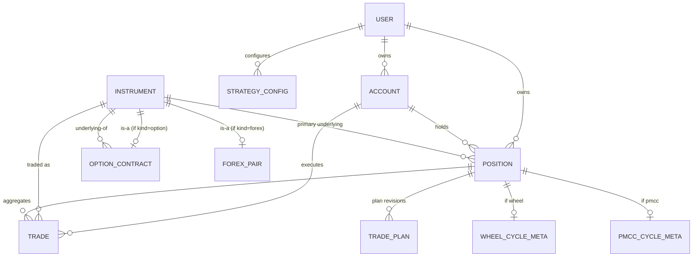

# 数据模型 — v0 草案

**语言：** [English](./data-model.md) | 中文

> 状态：**DRAFT v0.4**（2026-05-18）。`refactoring/rebuild` 分支重构的初版设计。本文档是 schema 讨论的 source of truth；写 migration 之前在这里迭代。文末有 changelog。

## 1. 目的与设计原则

上一版交易日志卡死的根本原因是数据模型**失去了 expandability**——新增策略或工具类型会迫使多张表和多处代码同步改动。这次重构从三条原则出发：

1. **原子化的 Trade，泛化的 aggregate。** `Trade` 是一笔券商级别的 fill。`Position` 是策略实例的聚合（也就是你在 Notion 里因策略不同而叫 "cycle" 或 "position" 的那个东西）。策略本身不"拥有"trades 表；它只是给 position 打标签，并可选地挂一张扩展元数据表。
2. **多态 Instrument 通过 class-table 扩展实现。** 股票、期权、外汇 pair 共享一个泛化的 `Instrument` 基表，再通过类型专属的扩展表延伸。未来加新工具类型（futures、crypto）按相同方式接入。
3. **能算就不存，必须存的才存 snapshot。** PnL、open 天数、ROI 等都从 trades 实时计算。唯一保留 snapshot 字段的场景，是"重算会丢失语义"的地方——如 defined-risk 多腿期权策略的 `max_risk_at_open`；又如 `pnl_realized` 在关仓时冻结，防止历史结果漂移。

这三条结合起来让 schema 变成**加法式**的：以后加 wheel、iron condor、PMCC、butterfly、calendar、forex CFD、crypto 都是"加一个 strategy_type 枚举值，可选加一张扩展表"——不会撕动主表。

## 2. 实体总览

| 实体 | 角色 |
|---|---|
| `User` | App 用户。MVP 用 FastAPI Users 做密码 + cookie 鉴权；OAuth / MFA / Audit / BrokerCredential 留作未来表（见 §7）。 |
| `Account` | 一个券商交易账户（Fidelity、IBKR、Saxo 等）。 |
| `Instrument` | 一个可交易标的，按 `kind` 多态。 |
| `OptionContract` | `kind=option` 时的 Instrument 扩展（strike、expiry、opt_type、multiplier）。 |
| `ForexPair` | `kind=forex` 时的 Instrument 扩展（base/quote currency、pip size）。 |
| `Position` | 策略实例聚合。跨策略统一。 |
| `Trade` | 一笔原子化的券商 fill，归属于一个 Position。 |
| `TradePlan` | 开仓前计划及其修订。挂在 Position 上的**事件流**。 |
| `StrategyConfig` | 策略级配置（例如 IC 的 max exposure 上限）。 |
| `WheelCycleMeta` | wheel position 的策略特定扩展。 |
| `PmccCycleMeta` | LEAP+PMCC position 的策略特定扩展。 |

**自 v0.1 起删除**：`IcPositionMeta`（它的唯一字段 `max_risk_at_open` 已上提到 `Position` 上，适用于任何 defined-risk 多腿策略）。

## 3. ER 关系图

## 4. 实体定义

> **下文使用的类型约定。** `numeric(p, s)` 是**精确十进制**的 fixed-point 存储：`p` 是**总**有效位数，`s` 是**小数点后**位数。SQLAlchemy 映射到 Python `Decimal`，**没有浮点误差**。Postgres 的 `NUMERIC` 和 SQLite 的 `NUMERIC` 都支持。
>
> 全文使用的默认值：
> - **价格**——`numeric(18, 6)`（涵盖股票、期权、外汇，留足余量）
> - **数量**——`numeric(18, 8)`（支持分数股和外汇 micro-lot）
> - **金额 / PnL / 现金流**——`numeric(18, 4)`
> - **比率 / 百分比**——`numeric(8, 6)`（例如 `0.045500` = 4.55% APR）
>
> 所有主键都是 `uuid`。所有时间戳都是 `timestamptz`（app 层强制 UTC）。

### 4.1 User

匹配 FastAPI Users 默认 schema，让 lib 直接负责密码哈希（bcrypt）、cookie/JWT session 策略、官方 OAuth 扩展。

| 字段 | 类型 | 说明 |
|---|---|---|
| id | uuid PK | |
| email | text unique | |
| hashed_password | text | 默认 bcrypt；可换 argon2。 |
| is_active | bool | 默认 `true`。设 false 软停用。 |
| is_verified | bool | 邮箱验证标志。 |
| is_superuser | bool | App 层管理员。 |
| last_login_at | timestamptz nullable | 登录成功时更新。Personal-grade 的异常感知线索。 |
| created_at | timestamptz | |

**未来的鉴权面**（**不在 MVP**，等到需要时单写 `docs/design/auth-and-security.md`——见 §7）：OAuthAccount、MfaCredential、MfaBackupCode、AuditLog、BrokerCredential。每个都是**带 `user_id` FK 指向 User 的新表**，因此加入这些表**不修改 User schema**。

### 4.2 Account

券商交易账户。与 journal app 自己的 User 是两回事。

| 字段 | 类型 | 说明 |
|---|---|---|
| id | uuid PK | |
| user_id | uuid FK → User | |
| name | text | "Fidelity Roth"、"IBKR Margin" 等。 |
| broker | text | "Fidelity" / "IBKR" / "Saxo" / ... |
| account_type | enum | `cash`、`margin`、`paper`。 |
| base_currency | text | ISO 4217。**仅作元数据** —— 表示券商把账户余额展示成哪种货币。**不参与任何 PnL 计算**；每个 position 的 PnL 落在 position 自己的货币里（见 §4.4、§6）。 |
| notes | text nullable | |
| created_at | timestamptz | |
| archived_at | timestamptz nullable | 软删除；保留历史。 |

**说明**：`account_type` 是券商自己的账户分类（cash / margin / paper trading）。Wheel 里"mixed funding"的概念在 `WheelCycleMeta.funding_source`（§4.8）里，**不在这里**——margin 账户完全可以承载纯 cash 资金的 position。

### 4.3 Instrument（base 表）+ 扩展

#### Instrument

| 字段 | 类型 | 说明 |
|---|---|---|
| id | uuid PK | |
| kind | enum | `stock`、`option`、`forex`（未来：`future`、`crypto`）。 |
| symbol | text | "NVDA"、"EURUSD"。期权情况下指 underlying 的 symbol。 |
| exchange | text nullable | "NASDAQ"、"EURONEXT"。按你的要求和 symbol 拆开，方便未来跨交易所标的。 |
| currency | text | Instrument 的交易 / 结算货币，ISO 4217。也是任何持有该 instrument 的 position 的 PnL 货币。对 forex pair 而言，必须等于 `ForexPair.quote_currency`（见 §6）。 |
| created_at | timestamptz | |

#### OptionContract（kind=option 时扩展 Instrument）

| 字段 | 类型 | 说明 |
|---|---|---|
| instrument_id | uuid PK, FK → Instrument | 与 Instrument 一对一。 |
| underlying_id | uuid FK → Instrument | 指向作为 underlying 的股票/指数 Instrument。 |
| opt_type | enum | `call`、`put`。 |
| strike | numeric(18, 6) | |
| expiry | date | |
| multiplier | int | 默认 100（美股期权）。设字段以支持未来非 100 的变种。 |
| style | enum | `american`、`european`。默认 `american`。 |

#### ForexPair（kind=forex 时扩展 Instrument）

| 字段 | 类型 | 说明 |
|---|---|---|
| instrument_id | uuid PK, FK → Instrument | |
| base_currency | text | "EUR" |
| quote_currency | text | "USD" |
| pip_size | numeric(10, 8) | 主流货币对多为 0.0001。 |
| contract_size | numeric(18, 4) nullable | Lot size；MVP 阶段不确定可暂缓。 |

**Forex PnL 约定**：外汇对的 PnL 永远落在 **quote 货币**（EURUSD → USD；USDCAD → CAD；EURJPY → JPY；GBPCHF → CHF）。所以 `Instrument.currency` 对 forex pair 必须等于 `ForexPair.quote_currency`。schema 不跨表强制这一点 —— 写入时由 API 层负责保持同步。

**股票** 不需要扩展表——MVP 所需字段 Instrument 已经覆盖。

### 4.4 Position（统一的策略实例聚合）

整张 schema 最重要的实体。每一个活跃的策略实例——wheel cycle、IC position、PMCC cycle、forex trade、stock holding——都是一个 Position。

| 字段 | 类型 | 说明 |
|---|---|---|
| id | uuid PK | |
| user_id | uuid FK → User | |
| account_id | uuid FK → Account | |
| primary_instrument_id | uuid FK → Instrument | 期权策略的 underlying；spot 时就是 stock/forex 本身。用于聚合/查询。 |
| strategy_type | enum | `wheel`、`iron_condor`、`pmcc`、`spot_stock`、`spot_forex`（可扩展）。 |
| status | enum | `open`、`closed`。 |
| opened_at | timestamptz | 第一笔 trade 的 executed_at。 |
| closed_at | timestamptz nullable | status 翻为 closed 时设为最后一笔 trade 的 executed_at。 |
| capital_used | numeric(18, 4) nullable | 策略定义的"风险敞口"（见下方说明）。MVP 阶段手填；将来可计算。 |
| max_risk_at_open | numeric(18, 4) nullable | 开仓时的最大亏损 snapshot。适用于任何 defined-risk position（IC、vertical、butterfly 等）。Undefined-risk position（PMCC、spot）保持 null。 |
| max_reward_at_open | numeric(18, 4) nullable | 开仓时的最大盈利 snapshot。适用范围同 `max_risk_at_open`。 |
| pnl_realized | numeric(18, 4) nullable | **关仓时冻结**：status 翻为 `closed` 时从 trade cash flow 计算并存储。Open 阶段保持 null。 |
| currency | text | 该 position 的 PnL 累计货币。**等于 `primary_instrument.currency`**（从 instrument 自动派生，用户不可设置）。详见 §6。 |
| notes | text nullable | 自由文本理由。 |
| created_at | timestamptz | |
| updated_at | timestamptz | |

**派生（不存储）：** `days_open`、`pnl_unrealized`、`pnl_total`、`roi_on_capital`、`annualized_return`、`result`（win/loss）。读取时从 `Trade` 行实时算出（status=open 的未实现部分需要市场行情）。

**`capital_used` 在各策略下的含义：**
- Wheel：对 Position 内**每一次** `sto put` 事件，累加 `(strike × 100 × qty − premium)`。**单调不减**——put 过期作废或被 btc 平仓时**不会**回退 `capital_used`，因为这笔资金曾在风险敞口里；保守的 ROI 分母可避免年化收益被高估。MVP 阶段手填；以后 services 层会自动计算。
- Iron condor / vertical spread / butterfly：等于 `max_risk_at_open`。
- PMCC：LEAP 的买入成本。
- Spot stock：总买入成本。
- Spot forex：保证金 × 杠杆（TBD）。

### 4.5 Trade（原子事件）

一笔券商 fill。未来对接券商 API 会直接写入这张表；MVP 阶段由用户手填。

| 字段 | 类型 | 说明 |
|---|---|---|
| id | uuid PK | |
| position_id | uuid FK → Position | 每笔 trade 都归属一个 position。 |
| account_id | uuid FK → Account | 冗余字段，便于查询；与 position.account_id 一致。 |
| instrument_id | uuid FK → Instrument | 实际交易的 instrument（期权时是具体的 OptionContract）。 |
| action | enum | 见下方 `TradeAction`。 |
| quantity | numeric(18, 8) | 股票：股数（支持分数股）；期权：合约张数（强制整数，app 层校验）；外汇：lots/units（支持 micro-lot）。 |
| price | numeric(18, 6) | 每股/每合约/每单位。**对期权是单张价格**（不是总价），与你 Notion 的习惯一致。 |
| commission | numeric(18, 4) | |
| fees | numeric(18, 4) | 其他监管/交易所费用，与 commission 分开，方便税务拆分。 |
| cash_flow | numeric(18, 4) | 带符号的净现金影响。负 = 现金流出（买入）；正 = 现金流入（卖出、开空期权）。存储是因为券商 API 会直接报这个值，同时避免每次读取都要重算。 |
| executed_at | timestamptz | |
| order_group_id | uuid nullable | 同一次用户操作 / 同一笔券商订单产生的多行 trade 共享这个 ID。见 §4.5.2。 |
| broker_trade_id | text nullable | 从券商 API 导入时填；手填为 null。 |
| notes | text nullable | |

#### 4.5.1 TradeAction 枚举

跨工具类型统一。**只有 6 个值**，刻意与策略名解耦——上一版 Notion 的 `type` 字段把开/平语义和策略名混在一起，本设计将两者干净分离。

| Action | 适用工具 | 含义 |
|---|---|---|
| `buy` | stock、forex | 开多 / 加多 |
| `sell` | stock、forex | 平多 / 减多 |
| `bto` | option | Buy to open（开多） |
| `sto` | option | Sell to open（开空） |
| `btc` | option | Buy to close（平空） |
| `stc` | option | Sell to close（平多） |

**没有 `assign` / `exercise` / `expire`。** 这些事件按其底层原子 trade 建模——这才是券商真实报告的形式。映射表见下。前端通过模式识别（同 `order_group_id` 的期权-stock 配对）展示成 "Assignment" / "Exercise" / "Expiration" 标签。

#### 4.5.2 Notion 事件 → 原子 trade 映射

下表说明你目前 Notion 里每个事件如何拆解成新 `Trade` 表的行。

| Notion 事件 | 原子 Trade 行 |
|---|---|
| sell put | 1 行：`sto` on the put OptionContract |
| close sell put | 1 行：`btc` on the put OptionContract |
| sell call | 1 行：`sto` on the call OptionContract |
| close sell call | 1 行：`btc` on the call OptionContract |
| buy LEAP | 1 行：`bto` on the LEAP OptionContract |
| close LEAP | 1 行：`stc` on the LEAP OptionContract |
| **assignment**（短 put 被指派） | 2 行，共用 `order_group_id`：`btc` put @ 0.00 + `buy` 100 股 @ strike |
| **assignment**（短 call 被指派） | 2 行，共用 `order_group_id`：`btc` call @ 0.00 + `sell` 100 股 @ strike |
| **exercise**（长 call 行权） | 2 行，共用 `order_group_id`：`stc` call @ 0.00 + `buy` 100 股 @ strike |
| **exercise**（长 put 行权） | 2 行，共用 `order_group_id`：`stc` put @ 0.00 + `sell` 100 股 @ strike |
| **expire**（短期权过期作废） | 1 行：`btc` @ 0.00，commission 0，fees 0 |
| **expire**（长期权过期作废） | 1 行：`stc` @ 0.00，commission 0，fees 0 |
| open iron condor | 4 行，共用 `order_group_id`：`bto` long put + `sto` short put + `sto` short call + `bto` long call |
| close iron condor，整体 | 4 行，共用 `order_group_id`：每条腿 `btc`/`stc` |
| close iron condor put side | 2 行，共用 `order_group_id`：`btc` short put + `stc` long put |

**为什么这样比专门加个 `assign` 枚举值好：** source of truth 变成"券商实际成交了什么"。同样的券商 fill，同样的 Trade 行——没有平行表示。UI 标签变成纯粹的展示层，按 `order_group_id` + 时序 + 数量级识别。

### 4.6 TradePlan（事件流）

你 Forex Excel 里的字段包含开仓前的计划价位。实际交易中这些价位会演变——交易者随价格移动止损、做部分止盈等。所以 TradePlan 建模为**事件流**：每行是一次 plan *revision*，最新 revision = 当前 plan，老行作为历史保留。

| 字段 | 类型 | 说明 |
|---|---|---|
| id | uuid PK | |
| position_id | uuid FK → Position | 一个 position 有多条 revision。 |
| revision_no | int | 在 position 内单调递增。第一次 revision = 1。 |
| effective_at | timestamptz | 该 revision 成为当前 plan 的时刻。 |
| planned_entry | numeric(18, 6) nullable | |
| planned_stop_loss | numeric(18, 6) nullable | |
| planned_take_profit | numeric(18, 6) nullable | |
| target_rr | numeric(8, 4) nullable | Risk-to-reward ratio。 |
| thesis | text nullable | 交易思路 / setup（一般只在 revision 1 填）。 |
| reason | text nullable | 为什么这次 revision（例如 "moved SL to BE after +1R"）。 |
| created_at | timestamptz | revision 记录被创建的时刻。 |

`(position_id, revision_no)` 唯一。应用查询"当前 plan"用 `MAX(revision_no) per position_id`，或等价地用 `effective_at` 最新的那一行。

部分平仓和减仓记在 `Trade`（一行 `sell` 加 quantity 较小），**不在 TradePlan**。TradePlan 只记录意图。

### 4.7 StrategyConfig（策略级配置）

| 字段 | 类型 | 说明 |
|---|---|---|
| id | uuid PK | |
| user_id | uuid FK → User | |
| strategy_type | enum | 与 `Position.strategy_type` 对齐。 |
| max_exposure | numeric(18, 4) nullable | 例如你给 iron-condor 总 `max_risk_at_open` 设的 $3000 cap。 |
| exposure_currency | text | 上限的货币。 |
| notes | text nullable | |
| updated_at | timestamptz | |

`(user_id, strategy_type)` 唯一。

**未来用途：** 接入券商 API 下单时，journal 校验 `sum(open_positions.max_risk_at_open where strategy=X) + new_order_max_risk ≤ max_exposure`，超额拒开。

### 4.8 策略特定扩展

扩展表与 Position 一对一（通过 `position_id` 匹配）。它们持有**仅此策略**才有意义的 snapshot 和配置数据。可计算/派生的值不放进来。snapshot 本身泛化适用的（如 `max_risk_at_open`）直接放在 `Position` 上，不需要扩展表。

#### WheelCycleMeta

| 字段 | 类型 | 说明 |
|---|---|---|
| position_id | uuid PK, FK → Position | |
| funding_source | enum | `cash`、`mixed`、`margin`。与 `Account.account_type` 独立——margin 账户也可以做纯 cash cycle。 |
| loan_amount | numeric(18, 4) nullable | 若使用 margin 借了多少。 |
| interest_rate_apr | numeric(8, 6) nullable | 当前用户手填；未来从券商 API 按天拉取。 |
| interest_accrued | numeric(18, 4) nullable | 每日利息累计。MVP 阶段存手填的总额；未来建模见 §7。 |

#### PmccCycleMeta

| 字段 | 类型 | 说明 |
|---|---|---|
| position_id | uuid PK, FK → Position | |
| leap_instrument_id | uuid FK → Instrument | 具体的 LEAP OptionContract。便利指针；其实也可从第一笔 trade 推导。 |

**为什么不再有 `IcPositionMeta`：** IC 唯一的 snapshot 字段是 `max_risk_at_open`，而这个概念可泛化到任何 defined-risk 多腿结构（vertical、butterfly、condor 各种变体）。现在它直接放在 `Position` 上。将来如果出现 IC 真正特有的字段，再加这张扩展表也不会撕动已有数据。

## 5. 各策略到模型的映射

### 5.1 Wheel

- 一个 Position，`strategy_type = wheel`，`primary_instrument_id` = underlying 股票。
- `WheelCycleMeta` 携带 funding / loan / interest 信息。

**生命周期不变式。** Wheel Position 处于 `open` 状态的条件：用户在同一 underlying 上至少持有以下之一——一条未平 short put 腿、一条未平 short call 腿、或非零的多头持股。当**三项同时为空**（无未平期权 *且* 净持股 = 0）时，状态翻为 `closed`。

**允许的原子 trade**（同一 Position 上任意顺序、任意次数）：`sto put`、`btc put`、`sto call`、`btc call`、`buy` 股票、`sell` 股票——加上 §4.5.2 的合成事件编码（过期作废用 `btc` / `stc` @ 0；assignment 和 exercise 用共享 `order_group_id` 的配对行）。

**模型支持的典型流程。**

| 流程 | Trade 序列 |
|---|---|
| 收权利金，未被指派 | `sto put` → `btc put` *或* 0 价过期行 → 关闭 |
| 经典单次指派的 wheel | `sto put` → assign 对 → N 次 `sto call`（穿插 `btc` / 过期） → exercise 对 *或* 主动 `sell` 股票 → 关闭 |
| **均价摊低**（本次修订的触发场景） | `sto put` @ K₁ → assign 对 → 股价继续下跌 → 同一 Position 上 `sto put` @ K₂<K₁ → 要么 0 价过期（权利金保留，等效摊低成本基础），要么再 assign 对（更多股票，均价降低） → 继续 put / call 操作 → 最终全部出场 → 关闭 |
| 同 strike/expiry 多张指派 | 同 strike/expiry 多行 `sto put` → 一次券商事件出多对 assign → 持股量更大 → 后续操作 |

schema 不强制任何顺序或数量约束。任意合法原子 trade 序列都是合法的 wheel；"策略形状"通过读 trade log 还原，不在 schema 规则里。设计理由见 §6。

### 5.2 Iron condor
- 一个 Position，`strategy_type = iron_condor`，`primary_instrument_id` = underlying 股票。
- 开仓事件 = 4 行 Trade（每条腿一行：long put、short put、short call、long call），共用一个 `order_group_id`。这才是券商真实的成交情况。
- `Position.max_risk_at_open` 开仓时计算并存储：`(wing width × multiplier × qty) − net credit`。
- 后续：`btc`/`stc` 用于部分或全部平仓；过期的腿用 0 价行表示。
- 4 条腿全部关闭/过期时 status 翻为 `closed`。

### 5.3 LEAP + PMCC
- 一个 Position，`strategy_type = pmcc`，`primary_instrument_id` = underlying 股票。
- 第一笔：`bto`(LEAP)。PmccCycleMeta.leap_instrument_id 设置。
- 循环短腿：`sto`(短 call) → `btc`（roll/平仓）、过期行、或被指派对（少见；如果发生 → 复杂情况，见 §7）。
- 短 call roll = `btc`（关掉当前的）+ `sto`（开新的），两行都在同一 Position 下；如果券商一起成交，通常会共享一个 `order_group_id`。
- Cycle 结束于 `stc`(LEAP) 或 LEAP 过期行。

### 5.4 Spot stock（MVP 阶段仅多头）
- 一个 Position，`strategy_type = spot_stock`，`primary_instrument_id` = 该股票。
- Trades：N 次 `buy`（允许 DCA），最终 M 次 `sell`。
- 净持仓 = 0 时 status 关闭。

### 5.5 Spot forex CFD
- 一个 Position，`strategy_type = spot_forex`，`primary_instrument_id` = ForexPair。
- Trades：开仓 `buy`（做空则 `sell`），平仓 `sell`（做空则 `buy`）；部分平仓追加 Trade 行 quantity 较小。
- TradePlan 挂事件流：revision 1 是初始 plan，后续 revision 记录 SL/TP 调整。

## 6. 关键设计决定与取舍

### 泛化 `Position` 优于每策略一张表
**决定：** 所有策略共用一张 `Position` 表。**理由：** 每个策略都要回答相同的问题（什么时候开的、PnL 多少、什么 instrument、哪个 account）。多表会强制 union 查询才能做组合层面的 view，并把派生计算重复 N 遍。在泛化模型下加新策略 = 加 1 个枚举值 + (可选) 1 张扩展表。

### Instrument 用 class-table inheritance
**决定：** `Instrument` 基表 + `OptionContract`/`ForexPair` 扩展。**理由：** 期权专属的 FK（`OptionContract.underlying_id`）在大宽表里无法干净表达。CTI 让针对期权的查询强类型化。"大宽表"恰好是上一版 expandability 烂掉的原因——加 crypto 又要塞一堆 nullable 列进已被期权字段污染的表。

### `max_risk_at_open` 放在 `Position`，不放策略扩展
**决定：** 作为 Position 上的泛化字段。**理由：** 这个概念能泛化到任何 defined-risk 策略。放 Position 上以后加 vertical spread / butterfly / iron fly 都不动 schema，并且避免一张只含一个字段的小扩展表。

### 为什么有些 snapshot 要存
- **`max_risk_at_open`**：重新计算它会让 position 演变过程中 ROI 分母变化。你明确要求保留开仓时的值。
- **`pnl_realized` 关仓后冻结**：历史结果不漂移——即使将来 trade 行被回填编辑、或者计算逻辑变化也不影响；也避免组合层报表跨多个已关仓 position 重复计算。

### Roll = 相邻两行 Trade
**决定：** Roll = 同一 Position 下相邻两行 Trade（close + open），可选共享 `order_group_id`。**理由：** 你的定义就是"roll = 同 cycle 内 close + open"。单独表只是台账，没有行为后果。

### `assign` / `exercise` / `expire` 按原子 trade 表达，不做枚举值
**决定：** 从 TradeAction 删除；按真实券商 fill 记录。**理由：** 券商上报的就是原子 trade（期权 0 平仓、股票按 strike 成交）。匹配该表示形式消除了"journal 数据 vs 券商实际行为"的分歧。UI 标签纯粹是渲染层，靠 `order_group_id` + 0 价模式识别。

### 为什么不把 Wheel 状态机烧进 schema

一个 Wheel Position 可以有多种形状：单 put 过期（未指派）；经典的 put → 指派 → call → 出场；或 v0.2 之后才发现的 put → 指派 → 在更低 strike 上**再开一张 put** 摊低成本 → 出场。任意合法原子 trade 序列都是合法 wheel。

如果当初把 "Wheel = 恰好一张 sell-put + 可选 assign + 可选 call" 烧进 schema（比如分开建 `sell_put_event` / `assignment_event` / `call_event` 表，或者对 `Trade.action` 序列做约束），那"均价摊低"流程就必须改 schema 才能记录。我们反过来——schema 接受 Position 上任意原子 `Trade` 序列；策略**含义**留给读取时还原。

这和把 `assign` / `exercise` / `expire` 从枚举里去掉是同一条原则：让数据模型忠于券商真实，让解读发生在应用层。

### PnL：关仓后才存
- 未平仓：从已实现 trade cash flow + 未平腿 mark-to-market 计算。
- 关仓后：snapshot 进 `pnl_realized`，历史结果稳定。
- 与"始终派生"的 tradeoff：存储开销很小；查询性能和稳定性收益显著。

### Currency 放哪里

三张表上的三种 currency 各司其职：

| 字段 | 角色 |
|---|---|
| `Instrument.currency` | Instrument 的**交易 / 结算货币**。股票：上市地货币（NVDA=USD，ASML.AS=EUR）。期权：标的的货币。外汇对：**quote 货币**（EURUSD→USD，USDCAD→CAD）。 |
| `Position.currency` | **等于 `Instrument.currency`。** 这个 position 的 PnL 落在这一货币里 —— MVP 阶段不做换算、不做跨币种聚合。 |
| `Account.base_currency` | **仅作元数据。** 表示券商把账户余额展示成哪种货币。**不驱动任何 PnL 计算**。 |

**MVP 不做汇率换算。** EUR 本位账户持有 NVDA，NVDA 的 PnL 记为 USD；同一账户持有 ASML.AS，PnL 记为 EUR；USDCAD position 的 PnL 记为 CAD。组合报表**按 currency 分桶**展示（"+$1,250 USD，+€180 EUR，−$45 CAD"），**不**合并成单一货币总额。

设计动机：这正好对应零换算零售交易者的心智模型 —— 交易者跟踪的就是交易货币里的原始 P&L；至于券商月底在账户层面换算到本位币，那是另一个运营层面的问题（也是真实存在的 FX 敞口，交易者可以选择对冲或忽略）。同时这也让 MVP 不必依赖实时汇率源。

**未来扩展（暂缓，详见 §7）。** 一旦接入汇率 provider，报表层可以提供 opt-in 的**展示期**换算到 `Account.base_currency`。这个换算只活在聚合 / 报表代码里，不写进 `Position.pnl_realized` —— 原始 PnL 永远以交易货币为准，历史结果不会因为汇率变化而漂移。

### SQLite → Postgres 可移植
- 所有数值列用 `numeric(p, s)`，两个引擎都精确十进制。
- UUID：SQLite 存为 TEXT；Postgres 用原生 uuid。SQLAlchemy `Uuid` 类型两边兼容。
- `timestamptz`：Postgres 原生；SQLite 退化为 naive `timestamp`，app 层须自律 UTC。
- 本草案不依赖 JSON-heavy 列；若以后加，两边都支持 JSON 但语义不同——尽量回避。

## 7. 待决问题与未来扩展

### 待决设计问题（实现前还需拍板）

1. **`delta_at_open` 及其它期权专属 snapshot 在 Trade 上的位置。** 你 Notion 里 trades 表记录开仓时 delta。直接给 `Trade` 加 nullable 列，还是开一张 `TradeOptionMeta` 扩展表存 delta/IV/theta/vega snapshot？**倾向：扩展表**，让 `Trade` 保持干净，并允许未来扩出更多期权 snapshot 字段。
2. **策略级敞口计算性能。** §4.7 提到下单时的拦截。schema 层就是一条查询；性能要求高时可加 materialized view 或汇总表。暂缓。
3. **Wheel margin 的利息累计。** 目前一个 `interest_accrued` 字段。未来可能要按天行存储以容纳每日 APR 变化。等券商 API 集成后再做。
4. **Position 上的 tags / labels。** 尚未建模。后续加 `tag` + `position_tag` 关联表即可。
5. **Position 和 Trade 的软删除。** `Account` 已有 `archived_at`；`Position` 和 `Trade` 是否同款？建议都加 archived_at 方便审计，但需先确认。
6. **`primary_instrument_id` 冗余性。** 是便利指针；技术上可从 trade 推导。为查询性能保留存储；插入时强制保持一致。

### 未来扩展（暂缓，schema 不预先承诺）

下表每项都会在 `docs/design/auth-and-security.md`（等到这块工作启动时再写）单独设计。当前 `User` schema 刻意保持最小，每项扩展都通过**新表 + `user_id` FK** 加入，不修改现有表。

| 扩展 | 触发实现的时机 | Schema 形状草图 |
|---|---|---|
| `OAuthAccount` | 加入 Google/GitHub 等社交登录时 | `user_id FK, oauth_name, account_id, account_email, access_token, refresh_token, expires_at`（FastAPI Users 官方形状）。 |
| `MfaCredential` + `MfaBackupCode` | 在支持任何密码之外的敏感操作之前（接入 broker API 之前一定要做完） | `MfaCredential(user_id FK, method=totp/webauthn, secret_encrypted, device_name, created_at, last_used_at)`；`MfaBackupCode(user_id FK, code_hash, used_at)`。 |
| `AuditLog` | 接入 broker API 之前；理想情况下更早 | `id, user_id FK, event_type enum, ip, user_agent, metadata jsonb, occurred_at`。Append-only。 |
| `BrokerCredential` | broker API 集成开始时 | `id, user_id FK, account_id FK, broker_name, credential_encrypted, kek_id, scope, created_at, last_used_at`。Envelope-encrypted；主 KEK 放环境变量 / secrets manager。 |
| `FxRate` + 汇率源集成 | 用户希望跨多币种持仓得到单一货币的组合视图时 | 按天（或按分钟）从外部 API 缓存的汇率 snapshot（ECB 基准汇率、OANDA、exchangerate.host 等）。Schema 草图：`FxRate(base, quote, rate, asof, source)`，主键 `(base, quote, asof)`。**仅作展示期换算** —— **不**修改 `Position.pnl_realized` 的存储方式。"换算到 Account.base_currency" 的逻辑活在报表 / 聚合层，每张报表 opt-in 决定要不要换算。 |

这四项都是**纯加法**——加任何一项都不修改 `User`、`Account`、`Position`、`Trade`。

### 已解决项（自 v0.1 起结案）

- ~~`assign` / `exercise` 的 decompose 时机~~ —— 解决：彻底删掉合成 action，从一开始就按原子 broker trade 建模（§4.5.2）。
- ~~多腿开仓作为单次用户操作~~ —— 解决：`Trade.order_group_id` 把同一次用户操作 / 同一笔券商订单的多行 trade 串起来（§4.5）。
- ~~`IcPositionMeta` 应该放哪~~ —— 解决：撤销，并入 `Position.max_risk_at_open`（§4.4）。
- ~~Forex 交易计划演变如何建模~~ —— 解决：TradePlan 是 revision 事件流（§4.6）。

---

## Changelog

- **v0.4（2026-05-18）** —— 货币模型澄清。`Account.base_currency` 明确为仅作元数据；`Position.currency` 等于 `Instrument.currency`（不是"通常等于 account base"）；外汇对的 PnL 落在 quote 货币；§6 "Currency 放哪里" 整段重写，撤销 MVP "position currency = account currency" 的简化假设；§7 新增 `FxRate` 表 + 汇率源集成的未来扩展条目，支持 opt-in 的展示期换算到 `Account.base_currency`。**schema 不变** —— 现有列承载新语义，新默认值 / 不变式在应用层维护。
- **v0.3（2026-05-18）** —— 针对真实交易场景做 Wheel 部分修订（v0.2 描述与现实不符）：§5.1 改写为"生命周期不变式 + 典型流程表"（现在显式覆盖多 put 摊低成本场景）；§4.4 `capital_used` Wheel 注释改为单调累加求和；§6 新增"为什么不把 Wheel 状态机烧进 schema"。**schema 文件不变**——原子 trade + 泛化 Position 模型本来就支持这个场景，是 v0.2 的文字描述错了。
- **v0.2（2026-05-18）** —— 应用用户审阅：TradePlan 改为事件流；删除 IcPositionMeta，改为泛化的 `Position.max_risk_at_open` 和 `max_reward_at_open`；User 重塑为 FastAPI Users 默认字段，未来鉴权表延后到 §7；`Account.account_type` 改为 `cash`/`margin`/`paper`；解释 `numeric(p, s)` 并明确默认值；quantity 扩到 `numeric(18, 8)` 支持分数股；`Position.pnl_realized` 改为关仓 snapshot；TradeAction 收缩到 6 个，`assign`/`exercise`/`expire` 按原子 trade 建模并给出显式映射表；新增 `Trade.order_group_id` 用于多腿 / 多笔聚合。
- **v0.1（2026-05-17）** —— 初版草案。

## 下一阶段交付物（本草案通过后）

1. 实现这些表的 SQLAlchemy 2.x models。
2. 初始 Alembic migration（dev 用 SQLite；保持 Postgres 兼容）。
3. 每种 `strategy_type` 至少一个 position 的 seed 数据，做端到端测试。
4. （以后，平台方向启动时）`docs/design/auth-and-security.md`。
